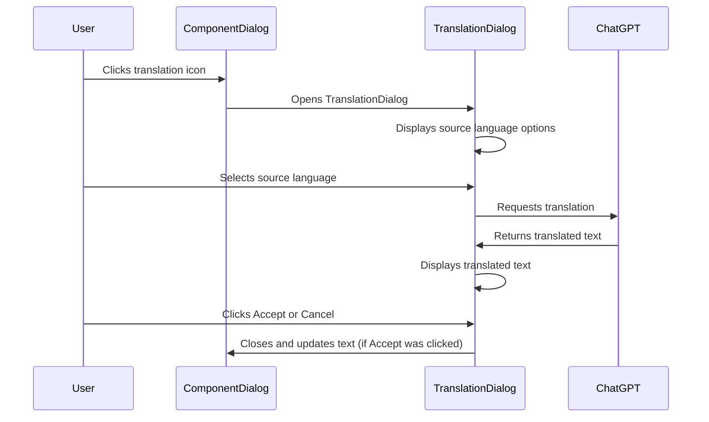

# Feature description for the Translation

## User workflow

When editing the properties of a component, the user finds a translation icon next to the dialog fields translateable
properties that have texts in other languages. Clicking on it opens the translation dialog.

The dialog presents the texts for all languages where there are texts for the property. If there are several, the
user can select via radio button which to use as the source language. Selecting the radio button triggers a request
to ChatGPT to translate. If there is only one source language, the translation request is triggered immediately. The
translation is then displayed in the dialog. The user can press 'Accept' or 'Cancel'.

## Dialog structure

+--------------------------------------------------+
|              Translation Assistance              |
+--------------------------------------------------+
| Source Language:                                 |
|                                                  |
| (o) EN - English Text                            |
| ( ) DE - German Text                             |
| ( ) FR - French Text                             |
| ( ) ES - Spanish Text                            |
|                                                  |
|                                                  |
|                                                  |
|                                                  |
| Translated Text:                                 |
|                                                  |
| Translated text from the selected language will  |
| be displayed here.                               |
|                                                  |
+--------------------------------------------------+
|               [ Accept ]  [ Cancel ]             |
+--------------------------------------------------+

## User interaction diagram

## Possible extensions later

It might make sense to have "translation profiles" where the user can give some instructions how to translate. For
instance the tone can be formal or informal.
