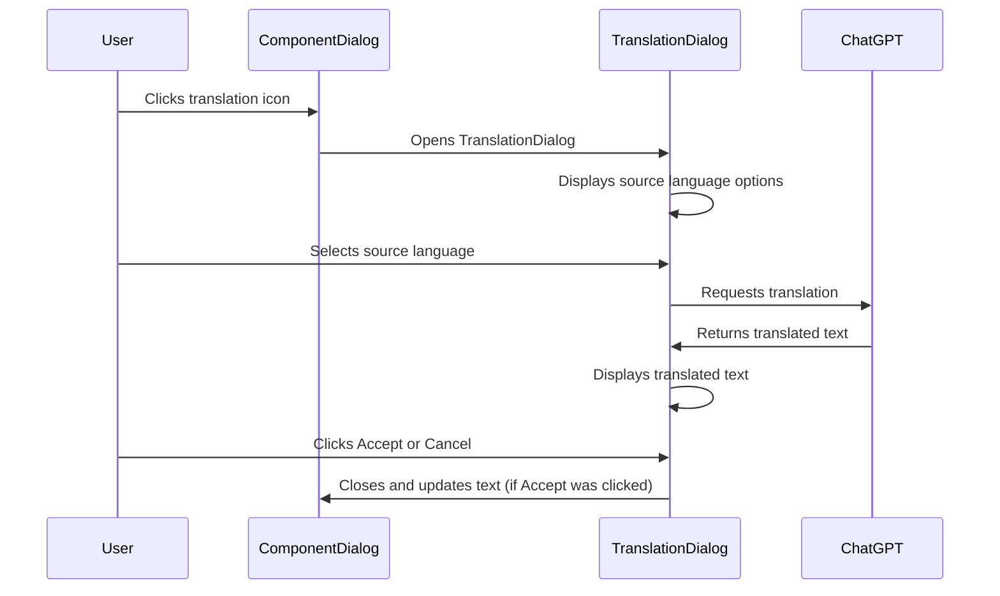

# Feature specification of the Translation Dialog

(This was created in part using ChatGPT, but before the
[feature creation process](FeatureCreationProcess.md) was attempted, but was later reworked to comply to that.)

## Background

A page in Composum Pages consists of various components where many of them contain text attributes. For instance a
teaser for another page (containing a title, subtitle and a text) or a text component that has a subtitle and a text, or
a section component that contains a title and other components.
Each site can be configured to have several languages. Each textual component attribute can have different values
depending on which of these languages the page is displayed in.

## Basic feature idea

When editing the properties of a component, the user finds a translation icon next to the dialog fields translateable
properties that have texts in other languages. Clicking on it opens the translation dialog.
The dialog presents the texts for all languages where there are texts for the property. If there are several, the
user can select via radio button which to use as the source language. Selecting the radio button triggers a request
to ChatGPT to translate. If there is only one source language, the translation request is triggered immediately. The
translation is then displayed in the dialog. The user can press 'Accept' or 'Cancel'.

## Basic implementation decisions

- An editing of the suggested translation in the translation dialog is not supported, since the user can accept the
  translation and then edit it in the component editing dialog he comes from.
- The translation icon is only visible in dialogs if there is at least one text in another language for that attribute.
- Triggering a translation of a text is either automatical, if there is only one source language, or is triggered by
  choosing the source language with it's radio button.

## Out of scope

- We currently only support translating one attribute at a time.
- There are currently no tools supporting translation consistency between the languages.

## User Workflow

To support the dialog design let's see some typical user workflows. Here are some likely use cases for the feature:

1. **Single Source Language Translation:**
   The user is editing a page and encounters a text field with a translation icon. The user clicks on the icon, and
   since there is only one source language available, the translation request is triggered immediately. The translated
   text is displayed in the dialog. The user can review the translation, and then decide whether to accept it (in which
   case it gets populated in the text field) or cancel the operation.

2. **Multiple Source Languages Translation:**
   The user is editing a page and sees a text field with a translation icon. The user clicks on the icon, and the system
   displays texts for all languages where there are texts for the property. Since there are multiple source languages,
   the user needs to select one via radio button. Upon selection, the system triggers a translation request. The
   translated text is then displayed in the dialog. The user can review the translation, and then decide whether to
   accept or cancel.

3. **Translation Error:**
   The user is editing a page and encounters a text field with a translation icon. The user clicks on the icon and
   selects a source language from multiple options. The system attempts to translate but encounters an error (possibly
   due to a network issue or an issue with the translation service). The system displays a message saying "Translation
   Error: Unable to translate text at this time." The user can close the dialog and return to editing the page, or try
   again.

## Dialog Elements

Given these workflows, the content creation dialog could have the following elements:

1. **Source Language Selector:** Radio buttons to select the source language for translation, and the text that is
   translated. The radio button is only visible if there are multiple source languages available for the selected text
   field. Selecting one of the languages triggers a translation request to ChatGPT, otherwise the translation is
   triggered on dialog display.

3. **Translation Display Area:** A section of the dialog where the translated text is displayed once the translation
   request is processed.

4. **Accept Button:** A button for the user to accept the translated text. Clicking this button populates the translated
   text into the text field and closes the dialog.

5. **Cancel Button:** A button for the user to cancel the operation. This would close the dialog without making any
   changes to the text field.

6. **Error Message Display:** An area to display error messages, if any, during the translation process.

8. **Loading Indicator:** A spinner or progress bar to indicate that the translation request is in progress.

7. **Translation Icon:** A small icon next to translateable properties in the component editing dialog. Clicking
   this icon opens the translation dialog. (Not part of the translation dialog.)

These elements should be designed in a user-friendly way, keeping in mind the intuitive user flow and the aesthetic look
of the application.

## Structure of the dialog

To build an intuitive and user-friendly interface for the dialog, it's crucial to structure the elements in a logical
order that aligns with the user's workflow. This involves grouping the elements based on their function and arranging
them in the sequence they are likely to be used. We order these dialog elements in the following groups below each
other. Some groups have subgroups, which have an individual frame around them.

1. **Error Message Display:** If there's an error during the translation process, an error message is displayed here,
   otherwise this is invisible.

2. **Source Language Group:** This group contains elements related to selecting the source language for translation. For
   each source language with a translateable text the following elements are repeated:
    - **Source Language Selector:** a radio button with the language name as label. Selecting a radio button triggers a
      translation request. Only visible if there is more than one source language.
    - **Source Text:** the text in that language to translate. To save space, this should be in the same line like
      the source language selector, or flow around it if it's not just one line.

2. **Translation Result Group:** This group contains elements related to the translated text.

    - **Loading Indicator:** This is only visible when a translation request is in progress. It can be a spinner or a
      progress bar.

    - **Translation Display Area:** The translated text is displayed here once the translation request has been
      processed. This area should be large enough to comfortably display longer texts.

3. **Action Buttons Group:**

    - **Accept Button:** The user clicks this button to accept the translated text. This will populate the translated
      text into the text field and close the dialog.

    - **Cancel Button:** The user clicks this button to close the dialog without accepting the translation.

## Example of a dialog layout:

+------------------------------------------------------------------------------+
| |
| "Translation Error: Unable to translate text at this time. Try again later." |
| |
+------------------------------------------------------------------------------+
| Source Language |
| +--------------------------------------------------------------------------+ |
| | (O) English | |
| | | |
| | "Welcome to our website!"                                                | |
| | | |
| | ( ) Spanish | |
| | | |
| | "¡Bienvenido a nuestro sitio web!"                                       | |
| | | |
| | ( ) French | |
| | | |
| | "Bienvenue sur notre site Web!"                                          | |
| +--------------------------------------------------------------------------+ |
| |
| Translated text |
| +--------------------------------------------------------------------------+ |
| | [Loading Indicator]                                                      | |
| | | |
| | Translation Display Area | |
| | | |
| | "Willkommen auf unserer Webseite!"                                       | |
| +--------------------------------------------------------------------------+ |
| |
| +--------------------------------------------------------------------------+ |
| | [Accept Button]                     [Cancel Button]                      | |
| +--------------------------------------------------------------------------+ |
+------------------------------------------------------------------------------+

## User interaction diagram

## Composum implementation references

See also [Composum Integration.md](../composum/ComposumIntegration.md) and [Architecture of the Composum Integration].

### Implementation of the translation

The dialog is rendered with `/libs/composum/chatgpt/pagesintegration/dialogs/translate/translate.jsp`
(resource composum/chatgpt/pagesintegration/dialogs/translate in Apache Sling) from
`com.composum.chatgpt.bundle.ChatGPTDialogServlet` and uses model
`com.composum.chatgpt.bundle.model.ChatGPTTranslationDialogModel` .
The URL is e.g.
`/bin/cpm/platform/chatgpt/dialog.translationDialog.html/content/ist/software/home/test/_jcr_content/jcr:description?propertypath=jcr:description&pages.locale=de`

The Javascript class TranslationDialog in `/libs/composum/chatgpt/pagesintegration/js/chatgpt.js` triggers the loading 
of the dialog and does call `com.composum.chatgpt.bundle.ChatGPTServlet.TranslateOperation` with
`/bin/cpm/platform/chatgpt/authoring.translate.json` for the translation.

## Test cases

Some informal testcases:

Sure, here are some informal test cases for the feature specified. These are based on the specification and aim to cover the basic functionality and edge cases.

1. **Single Source Language Translation:**
   - Scenario: The user clicks on the translation icon next to a single source language text field.
   - Expected outcome: The system automatically triggers a translation request and the translated text is displayed in the dialog.

2. **Multiple Source Languages Translation:**
   - Scenario: The user clicks on the translation icon next to a text field that has multiple source languages.
   - Expected outcome: The system presents texts for all available languages. Upon selecting one language via radio button, the system triggers a translation request and the translated text is displayed in the dialog.

3. **Translation Acceptance:**
   - Scenario: After viewing a translated text in the dialog, the user clicks the 'Accept' button.
   - Expected outcome: The translated text gets populated in the original text field and the dialog closes.

4. **Translation Cancellation:**
   - Scenario: After viewing a translated text in the dialog, the user clicks the 'Cancel' button.
   - Expected outcome: The dialog closes without making any changes to the original text field.

5. **Translation Error Handling:**
   - Scenario: The user selects a source language, but the system encounters an error during the translation process.
   - Expected outcome: The system displays a message saying "Translation Error: Unable to translate text at this time." The user can close the dialog and return to editing the page, or try again.

6. **Translation Icon Visibility:**
   - Scenario: The user opens a dialog with a text attribute that has no texts in other languages.
   - Expected outcome: The translation icon is not visible next to the text attribute.

## Possible extensions later

- It might make sense to have "translation profiles" where the user can give some instructions how to translate. For
  instance the tone can be formal or informal.
- batch translation of whole components or whole pages from one language - the user has to review everything.
- Custom Glossary: Let users create a custom glossary of specific translations for certain terms.
- Contextual Information: Provide system with contextual information about the website to improve translation accuracy.
- AI Language Style Customization: Customize the tone and style of the AI translator to match the website's voice.
- Something to support translation consistency over time between languages? Marks for outdated translations?
