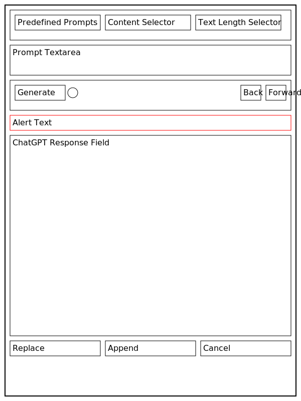

# Feature specification of the Content Creation Dialog

## Basic idea

A page in Composum Pages consists of various components where many of them contain text attributes. For instance a
teaser for another page (containing a title, subtitle and a text) or a text component that has a subtitle and a text, or
a section component that contains a title and other components. We want to create a content creation dialog that can be
opened from any of the attribute textfields or textareas or richtext editors in the component dialog and support
creating content for that attribute, which will replace the attribute content if the user presses "Replace" in the
dialog  
or be appended to the attribute content when the user presses "Append" on the dialog. It should provide a good
balance of being flexible to use, and not being too complicated.

The content creation itself is to be implemented using the ChatGPT completion API. The user can specify
ChatGPT prompts in various ways, and include existing text from the page as additional input for ChatGPT, so that
ChatGPT can be used to create content from a prompt, extend content, summarize content, excerpt content, make
suggestions to improve the text, title generation and more.

## Basic implementation decisions

- The content creation dialog should contain all necessary elements from the beginning - it should not be a flow of
  several dialogs, but a single dialog the user works in until they are satisfied.
- For textareas and richtext there is an optional drop down list to give an indication of the wanted text length with
  some rough indication of the desired text length. For textfields (a single line of content) that is absent.
  Options for this drop down list would be: "one line", "one sentence", "one paragraph", "several paragraphs".
- For now we will just request one variant at a time from ChatGPT.
- For selecting the content to include as additional input for ChatGPT, a drop down list with the following options: it
  could include the current text of the edited attribute, the text of the edited component (and subcomponents, if
  applicable) and the full text of the whole page. This is the only way to provide existing content.
- We will make a history for the field that has the ChatGPT suggestion, as the user will very likely want to switch
  back and forth between the texts it generated and take the best one. For that we will need back and forth buttons.
  The history is cleared on each new dialog start.
- The dialog has to be resizeable to work with large amounts of text.
- There should be a loading indicator that shows whether we are currently waiting for a ChatGPT response. Stati:
  idle (= used also when done), processing.
- We will not allow the user to edit the ChatGPT response as this can be edited in the text field.
- For better usability, tooltips or help texts could be added to explain each feature of the dialog.

## Out of scope

We will currently not include 'temperature' and 'max tokens' settings. The wanted text length can be specified by
the user in the prompt. We don't include a history and also no undo feature.

## User Workflow

To support the dialog design let's see some typical user workflows. Here are some likely use cases for the feature:

1. **Content Generation:** The user wants to create new content for a blank text field. They open the content creation
   dialog, write a prompt in the prompt field and select the desired text length from the dropdown menu. They then
   press "Replace" and the generated content is added to the text field.
2. **Title Generation:** The user wants to create a title for a section or page based on the content of that section
   or page. They can open the content creation dialog on the title textfield, select the option to include the text of
   the edited component or the full text of the page, select "summary" the prompt, and then press "Replace". The
   generated title replaces the existing title.
3. **Content Summary:** The user wants to create a summarized version of a longer text, for example, for a title,
   subtitle, or summary paragraph. They open the content creation dialog, select the content to summarize (e.g. the
   current page text or the text of the current component, especially if it's a section with subcomponents), select
   "summary" and the intended length from the drop down menus. After pressing "Replace", the generated summary replaces
   the long text in the text field.
4. **Content Extension:** The user has already written a portion of the content but needs help extending it. They open
   the content creation dialog, write a continuation prompt in the prompt field, and select the option to include
   the current text of the edited attribute. They then select the desired text length from the dropdown menu and
   press "Append". The generated content is appended to the existing content in the text field. Alternatively, they
   could choose "extend" from the list of predefined prompts. If the current text was to be replaced, since it was
   e.g. key points to be replaced by a full text, then the user would press "Replace".
5. **Content Improvement:** The user is not satisfied with the written content and wants suggestions to improve it.
   They open the content creation dialog, write a prompt asking for improvements or select "improve" from the list
   of predefined prompts, and select the option to include the current text of the edited attribute. They then press
   "Replace", and the generated improved content replaces the existing content in the text field.
6. **Excerpt Generation:** The user wants to create an excerpt from a longer piece of content. They open the content
   creation dialog, write a prompt asking for an excerpt, and select the option to include the current text of the
   edited attribute or the full text of the page. They then press "Replace", and the generated excerpt replaces the
   existing content in the text field.
7. **Idea Generation:** The user is stuck on creating new content and needs some inspiration. They open the content
   creation dialog, write a general prompt in the prompt field related to the topic they need ideas on, and then
   press "Replace". The generated ideas or suggestions will replace the current text in the text field. They can
   continue to iterate on this until they find an idea that they like.

## Dialog Elements

Given these workflows, the content creation dialog could have the following elements:

- **Prompt Field:** A text field where the user can write a custom prompt for ChatGPT. It should be a text area that
  can contain multiple lines.

- **Predefined prompts:** Dropdown menu with pre-defined prompts like "summary", "improve", "extend", "title
  generation", etc. that are suitable for various use-cases. Selecting this will replace the prompt field content.

- **Content Selector:** A dropdown menu for selecting the content to include as additional input for ChatGPT. The
  options could include the current text of the edited attribute, the text of the edited component (and subcomponents,
  if applicable) and the full text of the whole page. An abbreviation of that content will be displayed as tooltip
  for the individual elements of the selection.

- **Text Length Selector:** For textareas and richtext editors, a dropdown menu to select the desired text length.
  Options could include "one line", "one sentence", "one paragraph", "several paragraphs". This option is absent for
  textfields (a single line of content).

- **ChatGPT Response Field:** A text area to display the content generated by ChatGPT. This should be a large,
  resizable area since the generated content can be quite long. We do not allow editing, since the user can edit
  that in the dialog he called the ChatGPT dialog from. The user can see the generated content here before deciding to
  replace or append it to the existing content.

- **History Navigation:** A pair of "Back" and "Forward" buttons that allow the user to navigate through the history of
  generated texts for the current session. This way, they can easily compare different generated texts and choose the
  one they like best.

- **"Replace" Button:** This button will replace the existing content of the attribute with the content generated by
  the AI.

- **"Append" Button:** This button will append the content generated by the AI to the existing content of the attribute.

- **"Generate" Button:** This button will generate the content based on the provided prompt and additional input
  settings. The generated content will be shown in the Preview Area.

- **"Cancel" Button:** This button will close the dialog without making any changes to the existing content.

- **Loading Indicator:** An indicator showing the current status of the ChatGPT response. This could be a simple spinner
  that shows when the API is processing and disappears when the response is ready. The stati could be: idle (= used also
  when done), processing.

- **Close/Cancel Button:** A button to close the dialog without applying any changes. This is useful if the user decides
  not to use the generated content after all.

- **Alert:** a normally hidden area that can contain error messages or warnings. The text will be shown in red, so a 
  label is not necessary.

- **Help:** opens a page with a description of the dialog, and some example usages.

## Structure of the dialog

To build an intuitive and user-friendly interface for the dialog, it's crucial to structure the elements in a logical
order that aligns with the user's workflow. This involves grouping the elements based on their function and arranging
them in the sequence they are likely to be used. We order these dialog elements in the following groups below each
other. Some groups have subgroups, which have an individual frame around them.

1. **Prompt Group**: This group has the elements that the user interacts with to specify the prompt and the additional
   input for ChatGPT.
    1. **Prompt details**
        - Predefined Prompts
        - Content Selector
        - Text Length Selector
    2. **Prompt Area**:
        - Prompt Textarea (5 lines) with a label just above it.

2. **Generation Control**: This group lets the user control the generation process. All buttons are arranged in a
   horizontal line with two subgroups.
    1. **Generation Control**: let aligned
        - Generate Button
        - Loading Indicator
    2. **Content preview history navigation**: right aligned
        - Back
        - Forward

6. **Alert**: normally hidden.

3. **Content Preview**: Allows the user to review the generated content.
    - ChatGPT Response Field, with a label just above it.

4. **Content Actions and Dialog Control**: left aligned
    - Replace Button
    - Append Button
    - Cancel Button
    - Help Button (in addition to a help icon in the dialog frame)

The help and maximize buttons should appear as icons next to the close icon, all three right aligned on the top in 
the dialog frame.

## Preview of the dialog.

    +--------------------------------------------------------- [?] [□] [x] -+
    |                                                                       |
    | [\/Predefined] [\/Content Selector] [\/Text Length Selector]          |
    |                                                                       |
    | Prompt_Textarea______________________________________________________ |
    |                                                                       |
    | [Generate] [Spinner]            [Back] [Forward]                      |
    |                                                                       |
    | Alert_Text___________________________________________________________ |
    |                                                                       |
    | ChatGPT_Response_Field_______________________________________________ |
    | ________________________________________________________             |
    |                                                                       |
    |                                                                       |
    |                                                                       |
    |                                                                       |
    |                                                                       |
    |                                                                       |
    |                                                                       |
    |                                                                       |
    |                                                                       |
    |                                                                       |
    |                                                                       |
    | [Replace] [Append] [Cancel]                                           |
    |                                                                       |
    |                                                                       |
    +-----------------------------------------------------------------------+
Ascii-Art representing the dialog design.[^1]

Suggestion for dialog design.[^2]

<figure>
    <table border="1" width="100%">
      <tr>
        <td colspan="4" align="right">[Help] [Maximize] [X]</td>
      </tr>
      <tr>
        <td colspan="4">
          <table border="1" width="100%">
            <tr>
              <td>
                      <select>
                        <option value="">--Predefined Prompts--</option>
                        <option value="summary">Summary</option>
                        <option value="improve">Improve</option>
                        <option value="extend">Extend</option>
                        <option value="title">Title Generation</option>
                      </select>
              </td>
              <td>
                      <select>
                        <option value="">--Content Selector--</option>
                        <option value="current">Current Text of Edited Attribute</option>
                        <option value="component">Text of Edited Component</option>
                        <option value="page">Full Text of Page</option>
                      </select>
              </td>
              <td>
                      <select>
                        <option value="">--Text Length Selector--</option>
                        <option value="line">One Line</option>
                        <option value="sentence">One Sentence</option>
                        <option value="paragraph">One Paragraph</option>
                        <option value="multiparagraph">Several Paragraphs</option>
                      </select>
              </td>
            </tr>
            <tr>
              <td colspan="6">
                <label>Prompt</label>
                 
                <textarea rows="5" cols="50"></textarea>
              </td>
            </tr>
          </table>
        </td>
      </tr>
      <tr>
        <td align="left">
          <button>Generate</button>
          [Processing]
        </td>
        <td align="right" colspan="2">
          <button>Back</button>
          <button>Forward</button>
        </td>
      </tr>
      <tr>
        <td colspan="4" style="color:red;">Alert Area</td>
      </tr>
      <tr>
        <td colspan="4">
          <label>ChatGPT Response</label>
           
          <textarea rows="10" cols="50" readonly></textarea>
        </td>
      </tr>
      <tr>
        <td>
          <button>Replace</button>
          <button>Append</button>
          <button>Cancel</button>
          <button>Help</button>
        </td>
      </tr>
    </table>
  <figcaption>A wireframe rendering of the dialog.[^3]</figcaption>
</figure>
See footnote for related prompt.[^3]

## Implementation plan

The implementation of a dialog consists of the following parts:
- 
- possibly changes to the backend if necessary.

## Possible extensions

### Likely extensions

These are very recommendable, but lower priority and have some effort.

- The title attribute of the loading indicator should show the last actual request sent to ChatGPT, for transparency
  and debugging. A click on it could open a full screen read only dialog showing the complete request, scrollable.

### Not planned for now

These ideas might or might not make sense - that's best reviewed after the feature is implemented and has been used.

- Request several variants simultaneously
- temperature setting
- selection of desired tone and writing style, like in
  [Superpower ChatGPT](https://chrome.google.com/webstore/detail/superpower-for-chatgpt/amhmeenmapldpjdedekalnfifgnpfnkc)
- save parts of prompts for reuse (e.g. tone, writing style, general comments about the site, definitions, slogans)
- Some kind of templates: predefined structure descriptions for specific functions of the text
- Advanced Text Editing: Incorporate features such as grammar and spelling checks, readability analysis, and style
  suggestions, check whether it fits the intended tone
- More kinds of history, to go back to previous suggested variants and / or prompts
- automated linking to other pages / external content
- content suggestions reviewing the whole page.
- ai powered image selection
- The dialog should save the last used settings (e.g., the chosen additional input and desired text length) for the next
  time the dialog is opened. Not clear here to what extent: that depends on both the attribute, the component type
  and the component instance.

## Glossary

- **Component:** A reusable building block in Composum Pages, which can contain text attributes.
- **Attribute:** A property of a component, which can contain text.
- **Dialog:** In this context, the user interface for editing component attributes, and the proposed interface for
  interacting with the ChatGPT API.
- **ChatGPT Completion API:** The API used to generate text from prompts.
- **Prompt:** A text input that guides the AI in generating a specific type of text.
- **Replace/Append:** The actions to take with the generated text. Replace will change the current attribute text with
  the generated text, and append will add the generated text to the end of the current attribute text.
- **Textfield/Textarea/Richtext Editor:** Different types of input fields for text in Composum Pages.
- **Text Length:** A user-specified guideline for how long the generated text should be.
- **Additional Input:** Existing text that is used to give context to the AI when generating text.
- **History:** A record of generated texts for a specific attribute during a session of the Content Creation Dialog.
- **Session:** A single use of the Content Creation Dialog, from opening to either replacing/appending text or closing
  the dialog.
- **Loading Indicator:** A visual signal to show when the AI is processing a prompt and when it is ready.
- **Alert:** An area to display error messages or warnings.

[^1]: ChatGPT prompt to create that drawing:
Please create an ascii art of the dialog, rendered as markdown code block with 4 spaces indentation. 
Buttons should be rendered like [Cancel] when "Cancel" is the text on them, so that the layout is nicely shown.
Drop down lists can be rendered like [\/Predefined].
Text fields, Text areas should be shown with a description what is in there, spaces rendered as _, and with more _
showing the full space they occupy. (For text areas that will be several lines.)
Otherwise the dialog should look as closely as ascii art can make it to the fully implemented dialog. 
The names of groups and subgroups should not be shown, except if they should appear in the fully implemented dialog.
No explanation is necessary, please render just a drawing of the dialog in a ascii art code block.

[^2]: ChatGPT prompt to create that drawing:
Please create a code block with a SVG representation of the dialog, that could be rendered by a browser to display a suggestion for the dialog. 
The dialog should have a frame, group subgroups also with a small frame that surrounds the group of buttons etc.
The names of groups and subgroups should not be shown, except if they should appear in the fully implemented dialog.
The text fields and text areas should be rendered as a frame, with a descriptive text shown inside.
Render buttons and drop down lists with a frame, and indicate with a suitable symbol the drop down list. 
No explanation is necessary, please render just a drawing of the dialog in a SVG code block.
Please output only the svg tag and the svg elements, no comments, and take care to create a valid SVG including the 
xmlns declaration.

[^3]: ChatGPT prompt to create the HTML: 
Please create a HTML table that shows this dialog design as a wireframe. 
To render the dialog frame and internal frames and dividers, use the HTML table, tr and td attributes, 
but no CSS unless absolutely necessary. 
Use the align and valign attributes for alignments.
For drop down lists include the options, as far as they are already specified.
Render icons like e.g. [X] for the close icon, without showing their names.
You can use nested tables with a border to create nested frames for the subgroups.
The names of groups and subgroups should not be shown, only labels that should appear in the fully 
implemented dialog.
For the elements like buttons, input fields, text areas etc. you should use the corresponding HTML elements.
The dialog should look as closely as possible to the fully implemented dialog, while observing these conditions.
Do not output any comments or explanations, just a single code block with the HTML with the table element, no 
surrounding HTML or BODY tag.
