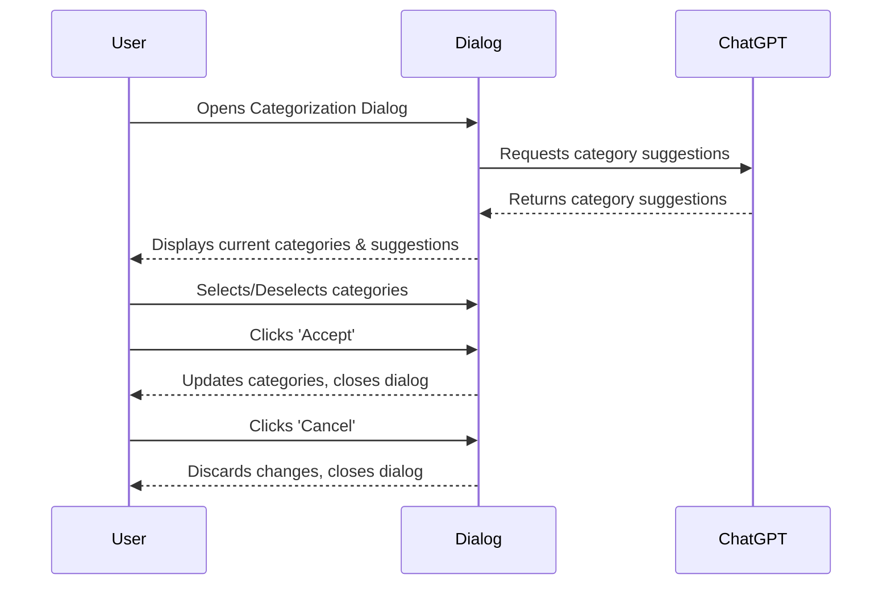

# Feature specification for a dialog to support setting page categories

## Basic idea.

Each page in Composum Pages can be given a list of categories (= keywords), mainly for SEO use. (It is rendered as
`<meta name="keywords" content="nodes,category1,category2">` in the page.) The categories can be set in the page
properties
dialog, where there is an extensible number of textfields which the user can type in categories and reorder the list.

To streamline this process, this feature utilizes the AI capabilities of ChatGPT to suggest categories.
Upon opening a dialog, the user will be presented with category suggestions generated by ChatGPT, which analyzes the
page's text content. This feature provides intelligent recommendations, minimizing the need for manual category input
and enhancing the page's SEO potential.

There are two basic use cases which have to be supported. The user might have created a new page and want to set
categories for it. But the user might already have set some categories, edited the page and now want to update the
categories.

## Basic implementation decisions

- The request to ChatGPT is triggered upon opening the dialog, but there must be an indication of the loading status,
  as this could take a while.
- In the dialog we display both currently assigned categories and the ChatGPT suggestions, so that the user can
  decide to add new and remove old in the same step. The 'Accept' button replaces the old categories. The old
  categories have preselected checkboxes, the new categories do not have preselected checkboxes. If ChatGPT suggests
  categories already present, they are still shown in both sections, and their selection status is joined.

## Out of scope

- We do not implement autocomplete, since that'd require many requests to ChatGPT which do cost a little money.
- In the new dialog, we do not support manually adding, editing or changing categories or reordering, as this can be
  done in the existing dialog.

## User Workflow

To support the dialog design let's see some typical user workflows. Here are some likely use cases for the feature:

1. **New Page Creation:**

   A user creates a new page and wants to set categories for it:

   a. The user writes the content for the page.
   b. After saving the content, the user opens the dialog for setting page categories.
   c. The system sends a request to ChatGPT to analyze the page's text content and suggest categories.
   d. While waiting for the response, the system shows a loading status.
   e. When the response arrives, the system displays the suggested categories.
   f. The user selects the relevant categories from the suggestions and saves them.

2. **Existing Page Editing:**

   A user has already set categories for a page, edited the page, and now wants to update the categories:

   a. The user edits the content of the page and saves the changes.
   b. The user opens the dialog for updating page categories.
   c. The system sends a request to ChatGPT to analyze the updated page content and suggest new categories.
   d. While waiting for the response, the system shows a loading status.
   e. When the response arrives, the system displays the suggested categories, highlighting those that were previously
   selected but also presenting new ones.
   f. The user can then deselect previously used categories if they are no longer relevant, select new relevant
   categories from the suggestions, and save the updated categories.

In both cases, the user has the option to dismiss the dialog without saving any changes if they are not satisfied with
the suggested categories.

This approach to suggesting categories after text content analysis should streamline the process and help users create
more effective and accurate SEO tags for their pages.

## Dialog Elements

Given these workflows, the content creation dialog could have the following elements:

1. **Alert:** a normally hidden area that can contain error messages or warnings. The text will be shown in red, so a
   label is not necessary. If ChatGPT does suggest no categories, a message displayed here.

2. **Current Categories Section:** This section lists the currently assigned categories (if any) with checkboxes
   before each one. If there are none, this section is not visible.

1. **Loading Indicator:** A visual cue (spinner) that indicates that ChatGPT is generating
   category suggestions. This appears immediately after the dialog is opened and disappears when the suggestions are
   ready.

3. **ChatGPT Suggestions Section:** This section lists the category suggestions generated by ChatGPT. Before each a
   checkbox is displayed; preselected are only those which also appear in the current categories section. If no 
   suggestions are there or while they are being loaded, this section is invisible. Alternatively visible to the 
   loading indicator.

4. **Accept Button:** A button that, when clicked, saves the selected categories to the page, replacing any previously
   assigned categories. This button is enabled only when at least one category has been selected.

5. **Cancel Button:** A button that, when clicked, closes the dialog without making any changes to the page's
   categories.

6. **Help Text:** A brief explanation at the top of the dialog explaining what categories are, how they improve SEO, and
   how to use the dialog. This text should be clear and concise to help users understand the purpose and functionality
   of the dialog.

7. **Dialog Title:** The title of the dialog, which could be something like "Page Category Suggestions" or "ChatGPT
   Category Suggestions."

## Structure of the dialog

To build an intuitive and user-friendly interface for the dialog, it's crucial to structure the elements in a logical
order that aligns with the user's workflow. This involves grouping the elements based on their function and arranging
them in the sequence they are likely to be used. We order these dialog elements in the following groups below each
other. Some groups have subgroups, which have an individual frame around them.

1. **Dialog Title:** Displayed at the top of the dialog, the label is "Page Category Suggestions."
2. **Help Text:** Positioned below the title, no label necessary as this is explanatory text: "This dialog helps set 
   or update page categories. Review 'Current Categories' and consider 'Suggested Categories' from AI. Select desired categories, deselect unwanted ones. Click 'Accept' to save changes, 'Cancel' to discard."
3. **Alert Area:** Situated below the Help Text, this area does not need a label.
5. **Current Categories Section:** This group is labeled "Current Categories" and is positioned under the Loading Indicator, which disappears once the categories are loaded. It contains:
    - A list of current categories with checkboxes. Each category label is the category itself.
6. **ChatGPT Suggestions Section:** This group is labeled "Suggested Categories" and is positioned below the Current Categories Section. It contains:
    - A list of suggested categories with checkboxes. Each category label is the category itself.
4. **Loading Indicator:** Spinner, positioned centrally within the dialog for clear visibility, no label required. 
7. **Action Button Group:** This group is positioned at the bottom of the dialog and does not require a label. It contains:
    - **Cancel Button:** With label "Cancel," positioned on the left of the save button.
    - **Accept Button:** With label "Accept," positioned on the right.

### Layout example

    +----------------------------------------+
    |            Page Category Suggestions   |
    +----------------------------------------+
    | This dialog helps set or update page...|
    +----------------------------------------+
    |                                        |
    +----------------------------------------+
    | Current Categories:                    |
    | [x] category1   [x] category2          |
    | [x] category3                          |
    +----------------------------------------+
    | Loading...                             |
    +----------------------------------------+
    | Suggested Categories:                  |
    | [ ] suggestion1  [ ] suggestion2       |
    | [ ] suggestion3                        |
    +----------------------------------------+
    |             [Cancel]   [Accept]        |
    +----------------------------------------+

## User interaction diagram

### Implementation remarks

The name of the feature that is used in names / IDs is "categorize".

#### Implementation parts:

The dialog is rendered with `/libs/composum/chatgpt/pagesintegration/dialogs/categorize/categorize.jsp` 
(resource composum/chatgpt/pagesintegration/dialogs/categorize in Apache Sling) from
`com.composum.chatgpt.bundle.ChatGPTDialogServlet` and uses model
`com.composum.chatgpt.bundle.model.ChatGPTCategorizeDialogModel`.
The URL is e.g.
`/bin/cpm/platform/chatgpt/dialog.categorizeDialog.html/content/ist/software/home/test/_jcr_content/category`
and the currently assigned categories are added as parameter 'category' (multiple values).

The suggested categories are loaded via an additional HTML AJAX request that loads the suggested categories. This is 
implemented via a selector:
`/bin/cpm/platform/chatgpt/dialog.categorizeDialog.suggestions.html/content/ist/software/home/test/_jcr_content/category`
`/libs/composum/chatgpt/pagesintegration/dialogs/categorize/suggestions.jsp`

The Javascript class CategorizeDialog in `/libs/composum/chatgpt/pagesintegration/js/chatgpt.js` triggers the loading 
of the dialog and the AJAX call for loading the suggestions.

The current categories are not taken from the resource, but from the dialog this is called from, since the user 
might have modified this.

Neccessary extensions:
- com.composum.chatgpt.bundle.ChatGPTDialogServlet new operation categorizeDialog

## Test cases

1. **Test Case 1: New Page Creation**

   **Objective:** Verify that the categorization dialog generates relevant category suggestions for a new page.

   - Steps:
     1. Create a new page with unique content.
     2. Save the content and open the categorization dialog.
     3. Check if category suggestions are generated and displayed.

   - Expected Result: Category suggestions should be relevant to the content of the new page.

2. **Test Case 2: Existing Page Editing**

   **Objective:** Verify that the categorization dialog updates the existing categories and generates new suggestions when a page is edited.

   - Steps:
     1. Edit an existing page with assigned categories.
     2. Save the changes and open the categorization dialog.
     3. Check if the existing categories are displayed, and new category suggestions are generated.

   - Expected Result: Existing categories should be displayed, and new relevant category suggestions should be generated.

3. **Test Case 3: Accepting Suggested Categories**

   **Objective:** Verify that selected categories are saved when the 'Accept' button is clicked.

   - Steps:
     1. Open the categorization dialog and select some categories (both existing and suggested).
     2. Click the 'Accept' button.
     3. Reopen the categorization dialog and verify that the selected categories have been saved.

   - Expected Result: The selected categories should be saved and displayed as current categories when the dialog is reopened.

4. **Test Case 4: Canceling Changes**

   **Objective:** Verify that no changes are saved when the 'Cancel' button is clicked.

   - Steps:
     1. Open the categorization dialog and select some categories (both existing and suggested).
     2. Click the 'Cancel' button.
     3. Reopen the categorization dialog and verify that no changes have been made to the categories.

   - Expected Result: The original categories should remain unchanged when the dialog is reopened.

5. **Test Case 5: Error Handling**

   **Objective:** Verify that the dialog displays an error message when the ChatGPT service is unavailable or returns an error.

   - Steps:
     1. Simulate an error with the ChatGPT service (e.g., by disconnecting from the internet or modifying the API request).
     2. Open the categorization dialog.
     3. Check if an error message is displayed in the alert area.

   - Expected Result: An error message should be displayed in the alert area, indicating a problem with the ChatGPT service.

## Possible extensions

- Give ChatGPT a list of categories that were used in the site to filter them, since those are likely suggestions.
- Save user defined categories? -> probably the previous suggestion is better and easier, too.
- Blacklist suggestions.
- When the user opens the page dialog, we could have ChatGPT send us a very long list of suggestions and use that
  for autocomplete as the user types.
- Integration with external SEO tools?
- Statistics for categories, page lists for each category etc.
