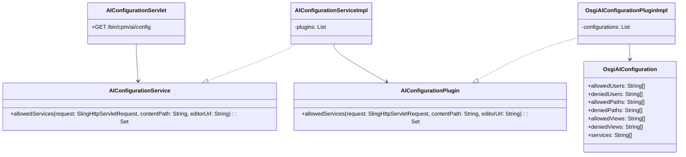

# Restricting the AI usage

(Feature draft, to be implemented in https://github.com/ist-dresden/composum-AI/issues/24)

## Basic idea

When testing or employing the Composum AI, one could need restrictions where it is employed. This feature should
provide the implementation of a service / servlet that can be used to configure the application.
The restrictions could be:

- restrictions for certain users or user groups
- restrictions to certain content paths
- restrictions to certain views, like the editor or page properties or ... , probably on the path of the URL shown in
  the browser
- restrictions to certain page types or components
- restrictions of the dialog (creation dialog or side panel AI or translation dialog or page category dialog)

That mechanism should go into submodule slingbase.

Some restrictions can be checked in the server whenever they apply to the whole page / session, but some parts could
only be checked in the browser, if they apply to the various components.

We should prepare a plugin mechanism to be extensible.

## Out of scope (ignored ideas not planned in this feature)

- we will not implement component specific restrictions, as that is difficult to check in the browser and likely much
  dependent on the system (Composum vs. AEM, AEM 6.5 vs. AEMaaCS)
- We might later want to add an OpenAI API Key configuration here, but it's not yet clear how that would fit in, as
  well as rate limiting configuration. So we ignore that in the current implementation.

## Implementation decisions

- If the AI is rolled out for various sites, we need to have additive configurations. Thus restrictions have to be "
  enable A for B" which can be implemented by a OSGI configuration factory with suitable configurations.
- we will heavily rely on regular expressions, but allow lists of regular expressions to give a better overview.
  There should be regular expressions for "allow" and "deny" for each category.
- There should be a Apache Sling servlet com.composum.ai.backend.slingbase.AIConfigurationServlet available with a
  GET operation that /bin/cpm/ai/config that takes the path to be edited as suffix and has a editorUrl parameter for
  the path of the URL in the browser. It should use a AIConfigurationService implemented in
  com.composum.ai.backend.slingbase.impl.AIConfigurationServiceImpl. The plugin interface should be  
  com.composum.ai.backend.slingbase.AIConfigurationPlugin .
- An implementation should go into a com.composum.ai.backend.slingbase.impl.OsgiAIConfigurationPluginImpl taking the
  configuration from OSGI as configuration factory.

## Needed implementation classes

1. **AIConfigurationServlet**
    - An Apache Sling servlet to provide access to AI configurations.
    - It should accept a GET request at `/bin/cpm/ai/config`.
    - This servlet interacts with the `AIConfigurationService` to check which services are allowed, based on the path
      and editor URL provided.
    - returns a JSON of allowed services (dialogs) like
      `{ allowedServices: { sidepanel: true, creation: true } }`
      , not allowed services are not listed.

2. **AIConfigurationService**
    - This is the primary service interface that provides methods to check which
    - It will have a default implementation, `AIConfigurationServiceImpl`.
    - This service will leverage any registered `AIConfigurationPlugin` instances to ask for allowed services.
      Interface: Set<String> allowedServices(SlingHttpServletRequest request, String contentPath, String
      editorUrl)

3. **AIConfigurationServiceImpl**
    - The default implementation of the `AIConfigurationService`.
    - This implementation will gather configurations from all the available `AIConfigurationPlugin` instances. If there
      are multiple plugins, it should ask all plugins and create a disjunction of the sets.

4. **AIConfigurationPlugin**
    - An interface that represents a source of AI configurations.
    - Plugins that implement this interface can provide configurations from various sources. This allows for
      extensibility.
    - Interface: Set<String> allowedServices(SlingHttpServletRequest request, String contentPath, String editorUrl)

5. **OsgiAIConfigurationPlugin**
    - The default implementation of the `AIConfigurationPlugin` interface.
    - This plugin will source configurations from the OSGI environment. It could read configurations defined in the OSGI
      Configuration Admin service.
    - It might leverage regular expressions for "allow" and "deny" configurations for each category.

6. **GPTPermissionConfiguration**:
    - **GPTPermissionConfiguration** - an @interface for OsgiAIConfigurationPlugin that represents a AI
      configuration. It may
      have fields like allowedUsers, deniedUsers, allowedPaths, deniedPaths, allowedViews, deniedViews, services and is
      used via configuration factory
      @Designate(..., factory = true) from OsgiAIConfigurationPlugin .
      Also used for Sling Context Aware Configuration as an alternative.

## OsgiAIConfiguration attributes

For the relevant configurations we will have allowedSomething and deniedSomething attributes,
both String[] of regular expressions. A service is only allowed when
there is an allowedSomething matching it, and no deniedXXX matching it in the configuration. For the planned
restrictions we need the following attributes:

- **allowedUsers** and **deniedUsers**: Lists of regular expressions that match usernames or user groups which determine
  if they are allowed or not allowed to use the AI services.

- **allowedPaths** and **deniedPaths**: Lists of regular expressions that match content paths to determine where the AI
  services can or cannot be employed.

- **allowedViews** and **deniedViews**: Lists of regular expressions that match the paths of the URLs shown in the
  browser to determine where the AI services can or cannot be employed. This could be specific to views like the editor,
  page properties, etc.

- **services**: A list of services to which this configuration applies to.

## Class diagram

ChatGPT: Please render interfaces as classes because of diagram syntax restrictions. If the mermaid plugin doesn't work,
please just print the mermaid diagram without using the plugin.

## Implementation ordering

OsgiAIConfiguration, AIConfigurationPlugin, OsgiAIConfigurationPluginImpl, AIConfigurationService,
AIConfigurationServiceImpl, AIConfigurationServlet.
