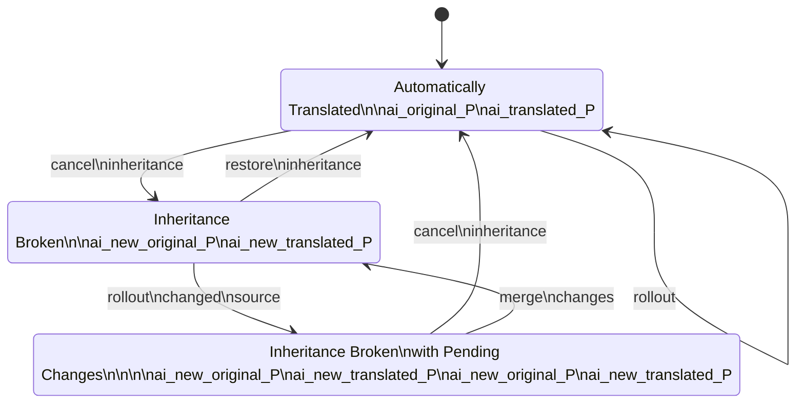
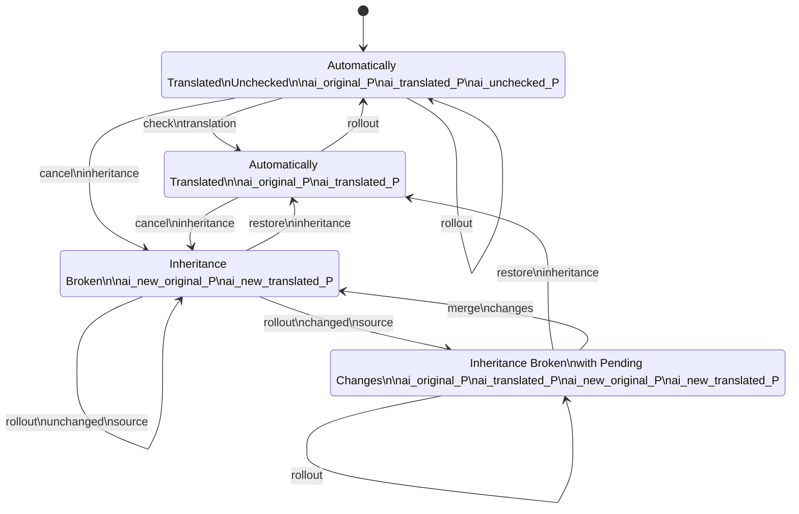
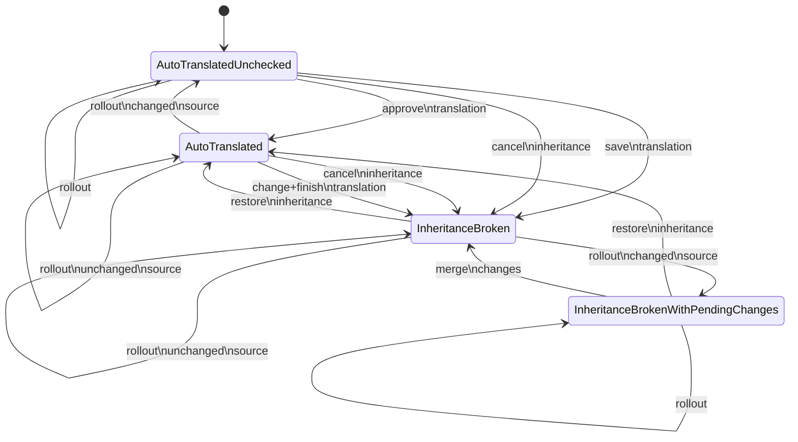

# Automatic Translation Checking

## Preliminaries

### Livecycle of properties

The following meta-properties might be present for a property {propertyName}:

- ai_original_{propertyName}: Stores the text in its original state before any AI-generated translation is applied.
- ai_translated_{propertyName}: Holds the AI-generated translation for the corresponding property.
- ai_new_original_{propertyName} is the value after the last rollout
- ai_new_translated_{propertyName} is the translation of ai_new_original_{propertyName}

### Current state diagram

### State diagram with check tool

AutoTranslateUnchecked:
- property = auto translated value
- ai_original_{propertyName} : source
- ai_translated_{propertyName} : auto translated value, as displayed
- ai_unchecked_{propertyName} : true, marker for checking

Changes:
- rollout splitten
- Anzeige welche Stati
- Diffs klären
- ai_approved: eigentlich 2 Sprachen
- 

