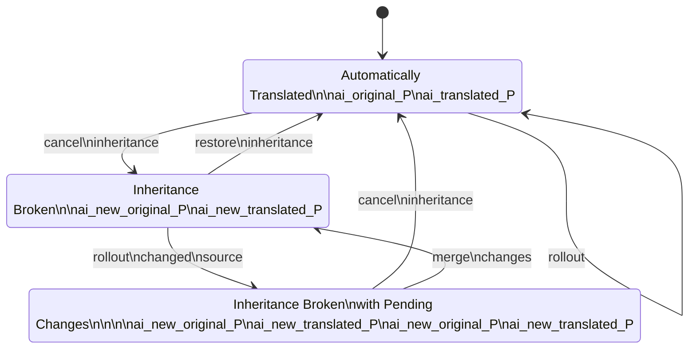
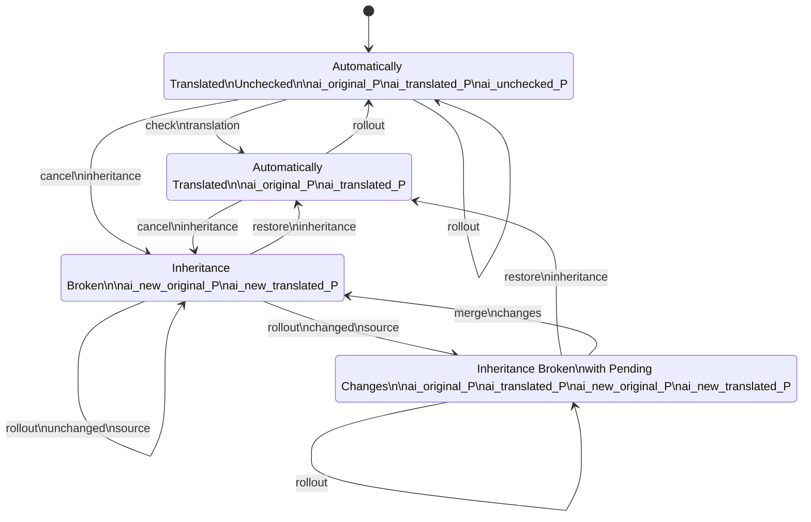
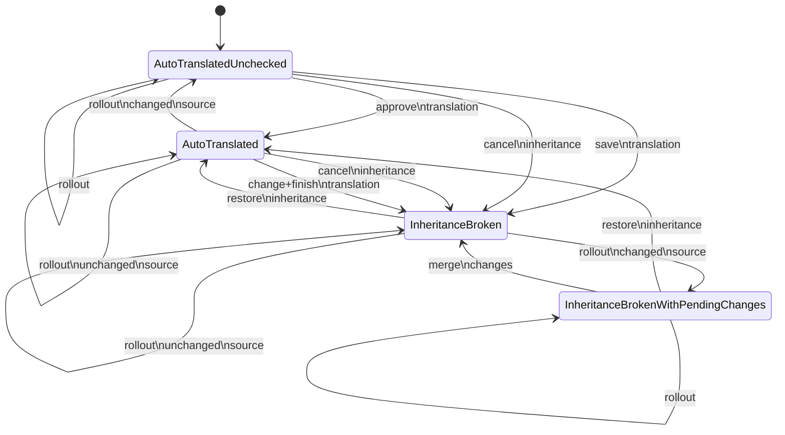

# Automatic Translation Checking

## Preliminaries

### Livecycle of properties

The following meta-properties might be present for a property {propertyName}:

- ai_original_{propertyName}: Stores the text in its original state before any AI-generated translation is applied.
- ai_translated_{propertyName}: Holds the AI-generated translation for the corresponding property.
- ai_new_original_{propertyName} is the value after the last rollout
- ai_new_translated_{propertyName} is the translation of ai_new_original_{propertyName}

### Current state diagram

### State diagram with check tool

AutoTranslateUnchecked:

- property = auto translated value
- ai_original_{propertyName} : source
- ai_translated_{propertyName} : auto translated value, as displayed

## Kinds of properties

Important point: a switch between inheritance cancelled and inheritance not cancelled can be done any time "behind
the back" of the translation mechanism. An important difference is that in the case of inheritance cancelled the
current content of the page counts as approved by the editor and can be changed any time behind the mechanisms back,
while in the case of enabled inheritance the approval is given only by action in the merge dialog.

### Inheritance not cancelled

Action:

1. Accept automatical translation -> inheritance is not cancelled
2. Cancel inheritance and switch to "inheritance cancelled" view (editing was disabled)

Case b): in the new "cancel inheritance" view we would have to see:

1. the diffs between last accepted source and current source
2. the last accepted translation
3. the translation of the new source

Columns:

1. last accepted source (deletions marked)
2. current source (insertions marked)
3. diffs between 1 and 2
4. last accepted translation
5. current value on page
6. (current value on page -> duplicate!)

- New property. Diff = empty vs. source value, editor and current text on page = autotranslated
  value
- Property that was accepted: no display (?). Diff = source value vs. source value, editor and current text on page =
  accepted value
- Property that was not yet accepted. Diff = old source value vs. new source value,

- property = initially the auto translated value. Can be different when inheritance cancelled, change and restore
- ai_original_{propertyName}: source for the last auto translation
- ai_translated_{propertyName}: result of the last auto translation
- ai_new_original_{propertyName} unmerged source for last rollout of inheritance cancelled property
- ai_new_translated_{propertyName} unmerged auto translation of new_original
- ai_accepted_source_{propertyName} source of property when user hit "accept" last time
- ai_accepted_translation_{propertyName} property value (= auto translation) of property when user hit "accept"

The ai_new_* and ai_accepted_* properties are alternatives - only one of them is stored, depending on the cancellation
state of the property / component.

Vorgang: die Übersetzungen wurden manuell überschrieben und sollen kontrolliert werden auf Basis der letzten
akzeptierten Übersetzungen.

### Inheritance cancelled

Action:

- Save and Finish: deletes ai_new_* and saves the current value
- "Restore inheritance": overwrites the current value with the last ai_new_translated, moves the ai_new_* to ai_*.

Columns: Original diffs / previously translated text + new source text , new text translation, editor for current
text, current text on page

- no new translation: no display (?). diff = same vs. same, editor and current text on page =
  current value
- new translation: diff = last checked source vs. new source, editor and current text on page =
  new translation

- property = initially the auto translated value. Can be different when inheritance cancelled, change and restore
- ai_original_{propertyName}: source for the last auto translation or the last "save and finish"
- ai_translated_{propertyName}: auto-translated result of the ai_original_{propertyName}. If the inheritance is not 
  cancelled, this should always be the same as the current value on the page since that is used during rollout if 
  the source is as in ai_original_{propertyName}.
- ai_new_original_{propertyName} unmerged source for last rollout
- ai_new_translated_{propertyName} unmerged ai translation result for the last rollout

## Important considerations

Cancelling / restoring inheritance has to work organically - the display has to make sense.

### Cancelling inheritance

If we cancel the inheritance and there was a "new translation" from a previous cancel inheritance
that'd be bad since that would be older than the automatically translated value -> *a rollout should remove new
translation if inheritance is enabled at that moment.* (Done in com.composum.ai.aem.core.impl.autotranslate.
AutoPageTranslateServiceImpl.translateLiveCopy).

It probably doesn't hurt if we don't change the accepted values during cancel / reenable, though.

If there is no new translation, the display for the editor doesn't make sense - it should probably just behave as if 
the new translation is exactly the same as the current translation.

### Reenabling inheritance

Assume we have a new translation and are restoring inheritance after a rollout. *Since the new translation is newer than
the currently set value, the new translation should overwrite the current value* - ai_original, ai_translated and 
current value. (Done in com.composum.ai.aem.core.impl.autotranslate.AutoTranslateMergeServiceImpl.changeInheritance). 
This means a cancel / reenable turnaround does change the current value - reenable is including sync.

Trouble: if the cancel / reenable is done in the editor, nothing changes. (Can't do anything about that - however, 
if the editor does a page sync while at that, it'll be fine.)

## Aspects

1. **Eindeutige Visualisierung von Zuständen**: Es wurde empfohlen, die unterschiedlichen Fälle (z.B. wenn die
   Inheritance gecancelt ist vs. nicht gecancelt) optisch klar zu unterscheiden. Dies könnte durch unterschiedliche
   Farben, Symbole oder Beschriftungen in den Überschriften der Spalten erreicht werden, um den Benutzern zu helfen, den
   jeweiligen Status der Übersetzungen besser zu verstehen.

2. **Einführung einer neuen Spalte für den alten, genehmigten Text**: Die Idee war, eine zusätzliche Spalte einzuführen,
   die den bereits genehmigten Text anzeigt, damit Benutzer den Unterschied zwischen dem aktuellen und dem vorigen Text
   leicht erkennen können. Dies hilft, Entscheidungshilfen zu geben, wenn die englische Version eines Textes
   aktualisiert wurde.

3. **Kombination von Funktionen**: Anstatt separate Tools für verschiedene Funktionen zu erstellen, wurde vorgeschlagen,
   alle relevanten Funktionen in einer einzigen Benutzeroberfläche zusammenzufassen. Dies würde den Editoren helfen,
   effizienter zu arbeiten, indem sie zwischen verschiedenen Ansichten und Aktionen leicht wechseln können.

4. **Verbesserung der Benutzeroberfläche (UI)**: Eine klarere Struktur der Benutzeroberfläche wurde als wichtig
   erachtet, um den Benutzern die Navigation und das Verständnis der Dialoge zu erleichtern. Dies könnte durch Tooltips,
   Hilfetexte oder klare Anweisungen innerhalb der Anwendung geschehen.

5. **Prüfung des Gesamttextes**: Es wurde betont, dass es wichtig ist, nicht nur die einzelnen Übersetzungen zu prüfen,
   sondern auch das Gesamtbild der Seiten im Auge zu behalten. Die Editoren sollten die Seiten nach der Bearbeitung noch
   einmal in ihrem Gesamtkontext überprüfen.
